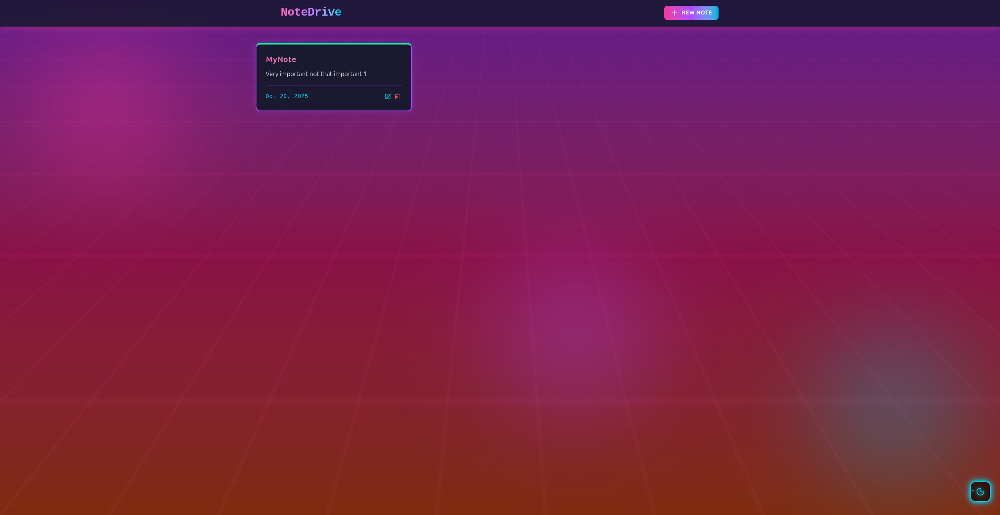
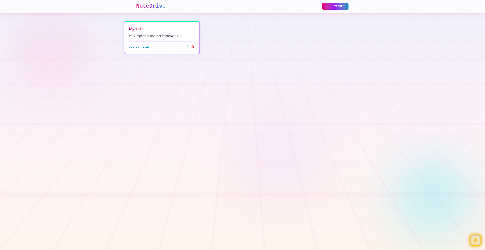
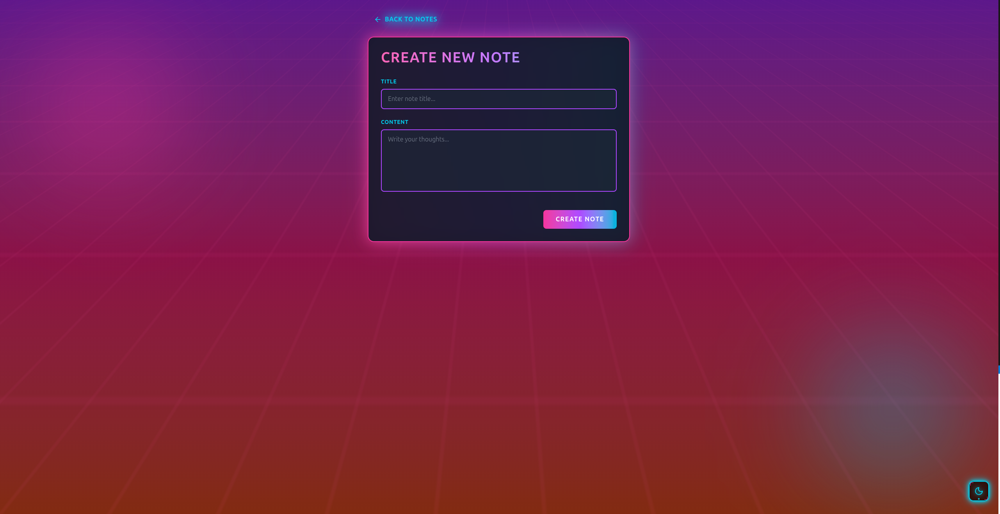
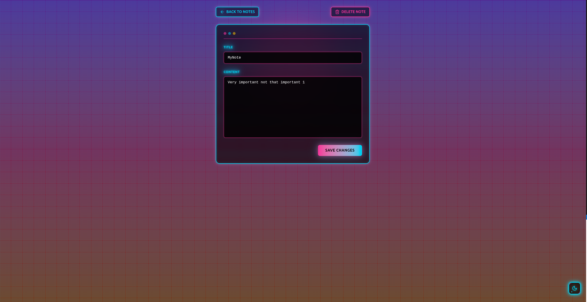

# 🌟 NoteDrive

<div align="center">


**A Stunning Full-Stack Note-Taking Application with Cyberpunk Aesthetics** 🚀

*Organize your thoughts in style with dark/light themes, smooth animations, and a futuristic UI*

[](https://reactjs.org/)
[](https://expressjs.com/)
[](https://www.mongodb.com/)
[](https://tailwindcss.com/)
[](LICENSE)

[Link](https://note-drive.netlify.app/) • [Report Bug](https://github.com/yourusername/notedrive/issues) • [Request Feature](https://github.com/yourusername/notedrive/issues)

</div>

---

## 📋 Table of Contents

- [✨ Features](#-features)
- [🎨 Screenshots](#-screenshots)
- [🛠️ Tech Stack](#️-tech-stack)
- [🚀 Getting Started](#-getting-started)
  - [Prerequisites](#prerequisites)
  - [Installation](#installation)
  - [Configuration](#configuration)
- [📦 Project Structure](#-project-structure)
- [🔌 API Documentation](#-api-documentation)
- [🎯 Usage](#-usage)
- [🌐 Deployment](#-deployment)
- [🤝 Contributing](#-contributing)
- [📄 License](#-license)
- [👨‍💻 Author](#-author)
- [🙏 Acknowledgments](#-acknowledgments)

---

## ✨ Features

### 🎭 **Stunning UI/UX**
- **Cyberpunk/Synthwave Design** - Neon glows, animated grids, and futuristic aesthetics
- **Dark & Light Themes** - Seamlessly switch between dark and light modes with smooth transitions
- **Smooth Animations** - Floating elements, scanline effects, and hover interactions
- **Responsive Design** - Perfect experience on desktop, tablet, and mobile devices

### 📝 **Note Management**
- ✅ **Create Notes** - Beautiful form with neon accents and real-time validation
- ✅ **Read Notes** - Card-based layout with gradient borders and hover effects
- ✅ **Update Notes** - Edit notes with inline editing and auto-save indicators
- ✅ **Delete Notes** - Confirmation dialogs with animated feedback
- 🔍 **Search & Filter** - Find notes quickly with real-time search

### 🔒 **Security & Performance**
- ⚡ **Rate Limiting** - Upstash Redis-powered rate limiting (100 requests/minute)
- 🛡️ **CORS Protection** - Configured for secure cross-origin requests
- 🚀 **Optimized Loading** - Lazy loading and code splitting for better performance
- 💾 **Data Persistence** - MongoDB for reliable data storage

### 🎨 **Developer Experience**
- 🔥 **Hot Module Replacement** - Instant feedback during development
- 📱 **Component Library** - Reusable React components with TypeScript support
- 🎯 **ESLint Configuration** - Code quality and consistency
- 📦 **Modern Build Tools** - Vite for lightning-fast builds

---

## 🎨 Screenshots

<div align="center">

### 🌙 Dark Mode

*Cyberpunk-inspired dark theme with neon accents*

### ☀️ Light Mode

*Clean and modern light theme*

### ✏️ Create Note

*Beautiful note creation form with animated background*

### 📄 Note Detail

*Edit notes with real-time updates*

</div>

---

## 🛠️ Tech Stack

### **Frontend**
| Technology | Version | Purpose |
|-----------|---------|---------|
|  | 19.1.1 | UI Library |
|  | 7.1.7 | Build Tool |
|  | 4.1.16 | Styling |
|  | 7.9.4 | Routing |
|  | 1.13.1 | HTTP Client |
|  | 5.3.10 | Component Library |

### **Backend**
| Technology | Version | Purpose |
|-----------|---------|---------|
|  | 18+ | Runtime |
|  | 5.1.0 | Web Framework |
|  | 8.18.1 | Database |
|  | 8.18.1 | ODM |
|  | 2.0.6 | Rate Limiting |

---

## 🚀 Getting Started

### Prerequisites

Before you begin, ensure you have the following installed:

- **Node.js** (v18 or higher) - [Download](https://nodejs.org/)
- **npm** or **yarn** - Comes with Node.js
- **MongoDB** - [Download](https://www.mongodb.com/try/download/community) or use [MongoDB Atlas](https://www.mongodb.com/cloud/atlas)
- **Git** - [Download](https://git-scm.com/)

### Installation

1. **Clone the repository**
   ```bash
   git clone https://github.com/yourusername/notedrive.git
   cd notedrive
   ```

2. **Install Backend Dependencies**
   ```bash
   cd Server
   npm install
   ```

3. **Install Frontend Dependencies**
   ```bash
   cd ../Client
   npm install
   ```

### Configuration

#### **Backend Configuration**

1. Create a `.env` file in the `Server` directory:
   ```bash
   cd Server
   touch .env
   ```

2. Add the following environment variables:
   ```env
   # MongoDB Configuration
   MONGO_URI=mongodb://localhost:27017/notedrive
   # or use MongoDB Atlas:
   # MONGO_URI=mongodb+srv://<username>:<password>@cluster.mongodb.net/notedrive

   # Server Configuration
   PORT=5001

   # Upstash Redis (for Rate Limiting)
   UPSTASH_REDIS_REST_URL=your_upstash_redis_url
   UPSTASH_REDIS_REST_TOKEN=your_upstash_redis_token

   # Frontend URL (for CORS)
   NETLIFY_FRONTEND_URL=http://localhost:5173
   ```

3. **Get Upstash Redis Credentials:**
   - Sign up at [Upstash](https://upstash.com/)
   - Create a new Redis database
   - Copy the `UPSTASH_REDIS_REST_URL` and `UPSTASH_REDIS_REST_TOKEN`

#### **Frontend Configuration**

1. Create a `.env` file in the `Client` directory:
   ```bash
   cd Client
   touch .env
   ```

2. Add the following environment variable:
   ```env
   VITE_API_URL=http://localhost:5001
   ```

### Running the Application

#### **Development Mode**

1. **Start the Backend Server**
   ```bash
   cd Server
   npm run dev
   ```
   Server will run on `http://localhost:5001`

2. **Start the Frontend (in a new terminal)**
   ```bash
   cd Client
   npm run dev
   ```
   Client will run on `http://localhost:5173`

3. **Open your browser and visit:**
   ```
   http://localhost:5173
   ```

#### **Production Mode**

1. **Build the Frontend**
   ```bash
   cd Client
   npm run build
   ```

2. **Start the Backend**
   ```bash
   cd Server
   npm start
   ```

---

## 📦 Project Structure

```
notedrive/
├── 📁 Client/                      # Frontend React Application
│   ├── 📁 public/                  # Public assets
│   ├── 📁 src/
│   │   ├── 📁 components/          # Reusable components
│   │   │   ├── FloatingThemeToggle.jsx
│   │   │   ├── Navbar.jsx
│   │   │   ├── NoteCard.jsx
│   │   │   ├── NotesNotFound.jsx
│   │   │   └── RateLimitedUI.jsx
│   │   ├── 📁 context/             # React Context
│   │   │   └── ThemeContext.jsx
│   │   ├── 📁 lib/                 # Utilities
│   │   │   ├── axios.js
│   │   │   └── utils.js
│   │   ├── 📁 pages/               # Page components
│   │   │   ├── CreatePage.jsx
│   │   │   ├── HomePage.jsx
│   │   │   └── NoteDetailPage.jsx
│   │   ├── App.jsx                 # Main App component
│   │   ├── index.css               # Global styles
│   │   └── main.jsx                # Entry point
│   ├── .env                        # Environment variables
│   ├── index.html                  # HTML template
│   ├── package.json                # Dependencies
│   ├── vite.config.js              # Vite configuration
│   └── README.md
│
├── 📁 Server/                      # Backend Node.js Application
│   ├── 📁 config/                  # Configuration files
│   │   ├── db.js                   # MongoDB connection
│   │   └── upstash.js              # Upstash Redis config
│   ├── 📁 Controllers/             # Route controllers
│   │   └── notesController.js
│   ├── 📁 middleware/              # Express middleware
│   │   └── rateLimiter.js
│   ├── 📁 models/                  # Mongoose models
│   │   └── Note.js
│   ├── 📁 routes/                  # API routes
│   │   └── noteRoutes.js
│   ├── .env                        # Environment variables
│   ├── .env.example                # Example env file
│   ├── package.json                # Dependencies
│   └── server.js                   # Entry point
│
└── README.md                       # You are here! 📍
```

---

## 🔌 API Documentation

### Base URL
```
http://localhost:5001/api
```

### Endpoints

#### **📝 Notes**

| Method | Endpoint | Description | Body |
|--------|----------|-------------|------|
| `GET` | `/notes` | Get all notes | - |
| `GET` | `/notes/:id` | Get note by ID | - |
| `POST` | `/notes` | Create new note | `{ title, content }` |
| `PUT` | `/notes/:id` | Update note | `{ title, content }` |
| `DELETE` | `/notes/:id` | Delete note | - |

### Query Parameters (GET /notes)

| Parameter | Type | Description |
|-----------|------|-------------|
| `userId` | String | Filter by user ID |
| `title` | String | Search by title (case-insensitive) |
| `tag` | String | Filter by tag |
| `createdAfter` | Date | Filter notes created after date |
| `createdBefore` | Date | Filter notes created before date |

### Example Requests

#### Create a Note
```bash
curl -X POST http://localhost:5001/api/notes \
  -H "Content-Type: application/json" \
  -d '{
    "title": "My First Note",
    "content": "This is the content of my note"
  }'
```

#### Get All Notes
```bash
curl http://localhost:5001/api/notes
```

#### Update a Note
```bash
curl -X PUT http://localhost:5001/api/notes/123 \
  -H "Content-Type: application/json" \
  -d '{
    "title": "Updated Title",
    "content": "Updated content"
  }'
```

#### Delete a Note
```bash
curl -X DELETE http://localhost:5001/api/notes/123
```

### Response Format

#### Success Response
```json
{
  "_id": "507f1f77bcf86cd799439011",
  "title": "My Note",
  "content": "Note content here",
  "tags": [],
  "createdAt": "2025-10-29T12:00:00.000Z"
}
```

#### Error Response
```json
{
  "message": "Error message here"
}
```

### Rate Limiting

- **Limit:** 100 requests per minute
- **Window:** 60 seconds (sliding window)
- **Response:** `429 Too Many Requests` when limit exceeded

---

## 🎯 Usage

### Creating Your First Note

1. **Click "New Note"** button in the navbar
2. **Enter a title** and **content** for your note
3. **Click "CREATE NOTE"** to save
4. Your note will appear on the home page!

### Editing a Note

1. **Click on a note card** from the home page
2. **Modify the title or content**
3. **Click "SAVE CHANGES"** to update
4. Changes are saved to the database

### Deleting a Note

1. **Click on a note card** to view details
2. **Click the "DELETE NOTE"** button
3. **Confirm the deletion** in the popup
4. Note is permanently removed

### Theme Switching

- **Click the floating theme button** (bottom-right corner)
- Seamlessly switch between **dark** and **light** modes
- Your preference is saved in localStorage

---

## 🌐 Deployment

### **Backend Deployment (Render)**

1. **Create a new Web Service on [Render](https://render.com/)**

2. **Configure the service:**
   - **Build Command:** `npm install`
   - **Start Command:** `npm start`
   - **Environment Variables:** Add all from `.env.example`

3. **Deploy and get your backend URL**

### **Frontend Deployment (Netlify)**

1. **Build your frontend:**
   ```bash
   cd Client
   npm run build
   ```

2. **Deploy to [Netlify](https://www.netlify.com/)**
   ```bash
   npm install -g netlify-cli
   netlify deploy --prod --dir=dist
   ```

3. **Update environment variables:**
   - Set `VITE_API_URL` to your Render backend URL

### **Database (MongoDB Atlas)**

1. **Create a cluster on [MongoDB Atlas](https://www.mongodb.com/cloud/atlas)**
2. **Whitelist IP addresses** (or allow from anywhere: `0.0.0.0/0`)
3. **Get your connection string** and update `MONGO_URI`

---

## 🤝 Contributing

Contributions are what make the open-source community such an amazing place to learn, inspire, and create. Any contributions you make are **greatly appreciated**!

### How to Contribute

1. **Fork the Project**
2. **Create your Feature Branch**
   ```bash
   git checkout -b feature/AmazingFeature
   ```
3. **Commit your Changes**
   ```bash
   git commit -m 'Add some AmazingFeature'
   ```
4. **Push to the Branch**
   ```bash
   git push origin feature/AmazingFeature
   ```
5. **Open a Pull Request**

### Code Style Guidelines

- Use **ESLint** for JavaScript linting
- Follow **React best practices**
- Write **meaningful commit messages**
- Add **comments** for complex logic
- Test your changes before submitting

---

## 📄 License

Distributed under the MIT License. See `LICENSE` for more information.

```
MIT License

Copyright (c) 2025 NoteDrive

Permission is hereby granted, free of charge, to any person obtaining a copy
of this software and associated documentation files (the "Software"), to deal
in the Software without restriction, including without limitation the rights
to use, copy, modify, merge, publish, distribute, sublicense, and/or sell
copies of the Software, and to permit persons to whom the Software is
furnished to do so, subject to the following conditions:

The above copyright notice and this permission notice shall be included in all
copies or substantial portions of the Software.
```

---

## 👨‍💻 Author

**NUll-O7**

- GitHub: [@NUll-O7](https://github.com/yourusername)
- Website: [notedrive.netlify.app](https://notedrive.netlify.app)
- Email: your.email@example.com

---

## 🙏 Acknowledgments

- [React Documentation](https://reactjs.org/)
- [TailwindCSS](https://tailwindcss.com/)
- [MongoDB](https://www.mongodb.com/)
- [Upstash](https://upstash.com/)
- [Lucide Icons](https://lucide.dev/)
- [DaisyUI](https://daisyui.com/)
- Inspired by cyberpunk and synthwave aesthetics

---

<div align="center">

### ⭐ Star this repo if you found it helpful!

Made with ❤️ and lots of ☕

**[Back to Top ⬆️](#-notedrive)**

</div>